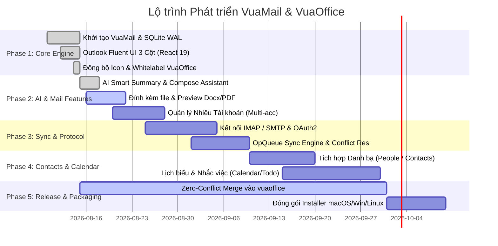

# ROADMAP.md — Lộ trình Phát triển VuaOffice & VuaMail Suite

> Tài liệu định hướng lộ trình phát triển tính năng cho bộ sản phẩm VuaOffice & VuaMail.

---

## 🎯 Tổng quan Mục tiêu (Milestones)

---

## 📌 Chi tiết các Giai đoạn Phát triển

### Giai đoạn 1: Core Engine & Fluent UI (Đã hoàn thành - v0.6.6)
- [x] Khởi tạo module `apps/mail` (@genoffice/mail) độc lập trong monorepo.
- [x] Xây dựng Database SQLite WAL mode (`vuamail-local.db`) với các bảng `accounts`, `email_folders`, `emails`, `email_bodies`, `op_queue`.
- [x] Port giao diện từ VuaMailUI (Blazorise Outlook) sang React 19 Fluent UI:
  - AppRail (thanh icon ứng dụng dọc).
  - FolderTree (Favorites & Hộp thư cá nhân).
  - MailList (tab Focused / Other, tìm kiếm thư, unread badge).
  - ReadingPane (nội dung thư HTML/Text, avatar, header chi tiết).
  - ComposeModal (soạn thư mới).
- [x] Tích hợp bộ icon và thương hiệu chính thức VuaOffice (`icon.png`, `icon.icns`, `icon.ico`).

### Giai đoạn 2: Trợ lý AI & Trải nghiệm Hộp thư (Đang thực hiện - v0.7.0)
- [x] Tích hợp AI Smart Summary (tóm tắt chuỗi email 3 ý chính).
- [x] Tích hợp AI Draft Assist (soạn thảo và trau chuốt email tự động).
- [ ] Xem trước tệp đính kèm tài liệu Office (DOCX, XLSX, PPTX, PDF) trực tiếp bằng engine VuaOffice.
- [ ] Quản lý đa tài khoản email và chuyển đổi hộp thư nhanh.
- [ ] Bộ lọc nâng cao: Lọc theo cờ (flagged), tệp đính kèm (has attachments), ngày gửi.

### Giai đoạn 3: Giao thức Mail & Đồng bộ Ngoại tuyến (v0.8.0)
- [ ] Hỗ trợ kết nối IMAP / SMTP với xác thực an toàn (OAuth2 Google / Microsoft 365 / Custom IMAP).
- [ ] Cơ chế đồng bộ 2 chiều ngầm (Background Sync Worker).
- [ ] Thực thi hàng đợi ngoại tuyến OpQueue (phát lại các thao tác đọc, xoá, di chuyển khi có mạng trở lại).
- [ ] Xử lý giải quyết xung đột dữ liệu (Conflict Resolution).

### Giai đoạn 4: Danh bạ & Lịch biểu (People & Calendar - v0.9.0)
- [ ] Port `PeoplePage.razor` sang `ContactList.tsx` và `ContactDetail.tsx` (quản lý danh bạ, nhóm liên hệ).
- [ ] Port `CalendarPage.razor` sang `CalendarScheduler.tsx` (xem lịch theo ngày/tuần/tháng, tạo sự kiện và lời mời họp).
- [ ] Quản lý công việc To-Do (tạo việc cần làm từ email).

### Giai đoạn 5: Phát hành & Đóng gói Phân phối (v1.0.0)
- [ ] Kiểm thử tự động E2E và tối ưu hiệu năng bộ nhớ.
- [ ] Quy trình tự động merge Zero-Conflict vào `vuaoffice/main`.
- [ ] Đóng gói bộ cài đặt Universal:
  - macOS (Apple Silicon DMG & Intel DMG).
  - Windows (x64 / x86 Setup EXE).
  - Linux (AppImage & DEB).
